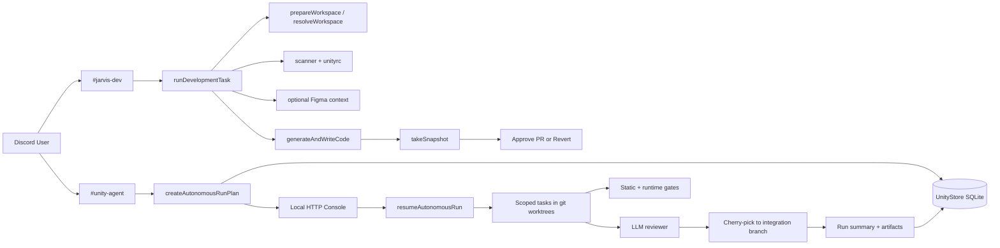

# Unity Agent (`brain-station`)

`brain-station` es el plano de control de Unity Agent: un sistema que trabaja sobre repositorios GitHub reales, recibe solicitudes por Discord, ejecuta cambios de codigo con ayuda de LLMs y expone una consola HTTP local para revisar, aprobar y observar runs autonomos.

Hoy el proyecto ya no es solo una idea o un experimento de "bot que edita archivos". El codigo actual implementa dos flujos operativos reales:

- `manual`: desarrollo asistido desde Discord con preview, snapshot y opcion de abrir PR.
- `autonomous`: planificacion, ejecucion por tareas acotadas, worktrees aislados, gates, reviewer, politicas y observabilidad persistida.

Este repositorio no es la aplicacion final que se modifica. Es el orquestador que prepara workspaces en `workspaces/`, opera sobre repositorios destino y guarda el estado operativo en `.unity/`.

## Estado actual

Unity Agent soporta hoy:

- Preparacion y actualizacion automatica de workspaces Git locales.
- Analisis de estructura del repositorio y carga de memoria de proyecto desde `.unityrc.md`.
- Contexto opcional desde Figma cuando el prompt incluye un link valido.
- Generacion de cambios de codigo mediante un loop de herramientas acotadas y autocorreccion por compilacion.
- Flujo manual por Discord con iteraciones por reply, snapshot de UI y botones para aprobar o revertir.
- Flujo autonomo con plan persistido, aprobacion desde consola local, ejecucion paralela por scopes y cierre con resumen operativo.
- Persistencia de runs, planes, tareas, eventos, artifacts, memorias y politicas en SQLite.
- Consola web local para inspeccionar graph, timeline, artifacts y estado de cada run.
- Scaffolding inicial de proyectos `expo`, `nest` y `fullstack`.

## Arquitectura



## Modos de operacion

### 1. Modo manual (`jarvis-dev`)

Flujo pensado para pairing rapido desde Discord:

1. El usuario escribe un prompt en el canal manual.
2. El runtime prepara un workspace limpio o reutiliza el actual si la solicitud es una iteracion por reply.
3. Se obtiene contexto del repo: arbol, memoria de proyecto y diff previo si aplica.
4. El agente ejecuta un loop de razonamiento con herramientas limitadas (`read_file`, `search_project`, `run_command`).
5. Los cambios se aplican con validacion TypeScript y autocorreccion cuando el parche o la compilacion fallan.
6. Si el repo destino lo permite, se levanta preview local y se captura snapshot con Puppeteer.
7. Discord devuelve links locales, diff, snapshot y botones para:
   - aprobar y abrir PR
   - revertir y volver a un estado limpio

Notas del flujo manual:

- La aprobacion de sesion genera un commit message/PR metadata a partir del diff final.
- La iteracion se hace respondiendo al mensaje anterior, no iniciando una tarea limpia.
- El runtime solo permite una tarea activa a la vez.

### 2. Modo autonomo (`unity-agent`)

Flujo pensado para ejecucion multi-task con trazabilidad:

1. El usuario escribe un prompt en el canal autonomo.
2. El sistema prepara el workspace base y garantiza la branch de integracion.
3. Se corren gates base del repo para establecer una linea base antes de tocar codigo.
4. El planner genera un plan JSON con tareas acotadas por `writeScope`.
5. El plan se persiste y, en modo interactivo, queda esperando aprobacion desde la consola local.
6. Una vez aprobado, cada tarea se ejecuta en su propio `git worktree`.
7. Cada resultado pasa por:
   - gate de scope
   - comparacion contra fallas baseline
   - gates estaticos por package/script
   - reviewer con capacidad de sugerir follow-up tasks
8. Las tareas aprobadas se integran por `cherry-pick` en la branch de integracion y se empujan a remoto.
9. El run puede abrir ciclos de mejora adicionales si la politica lo permite y aun hay presupuesto de tiempo/commits.
10. El cierre genera artifacts, resumen final, runtime verification y estado persistido.

Notas del flujo autonomo:

- En `interactive`, el plan espera aprobacion manual.
- En `nightly`, puede autoaprobarse si la politica del proyecto lo habilita.
- El flujo autonomo hoy empuja cambios a una branch de integracion, pero no abre un PR automaticamente.

## Componentes principales

### Entrypoints

- `index.ts`
  Inicializa el cliente de Discord, el runtime compartido y la consola HTTP local.

### Capa de aplicacion

- `src/application/run-development-task.ts`
  Orquesta el flujo manual completo: workspace, contexto, generacion, snapshot y artifacts.

- `src/application/run-autonomous-agent.ts`
  Implementa el ciclo completo de runs autonomos: plan, aprobacion, tareas, retries, improvement cycles, integracion y cierre.

- `src/application/approve-session.ts`
  Convierte una sesion manual aprobada en un Pull Request real.

- `src/application/reject-session.ts`
  Limpia el workspace de una sesion manual rechazada.

### Servicios de IA

- `src/services/ai/agent-runner.ts`
  Loop principal de generacion de codigo con herramientas, aplicacion de parches y autocorreccion. Usa `deepseek-reasoner` para la fase principal de edicion.

- `src/services/ai/client.ts`
  Cliente DeepSeek con retry de red.

- `src/services/ai/pr-metadata.ts`
  Genera metadata de PR/commit message a partir del diff final.

- `src/services/orchestration/planner.ts` y `src/services/orchestration/reviewer.ts`
  Usan `deepseek-chat` para planning y revision estructurada.

### Orquestacion autonoma

- `src/services/orchestration/planner.ts`
  Crea planes JSON con tareas paralelizables y `writeScope`.

- `src/services/orchestration/policy-engine.ts`
  Resuelve y normaliza la politica autonoma por proyecto.

- `src/services/orchestration/gates.ts`
  Ejecuta `typecheck`, `lint`, `test`, `build` y runtime gate cuando aplica.

- `src/services/orchestration/reviewer.ts`
  Revisa el diff de una tarea, interpreta gates y propone follow-up tasks.

- `src/services/orchestration/worktree-manager.ts`
  Crea worktrees aislados por tarea y sincroniza soporte local como `.env` o `node_modules`.

- `src/services/orchestration/branch-manager.ts`
  Garantiza branch de integracion, commits, push y cherry-pick.

### Persistencia y runtime

- `src/services/persistence/unity-store.ts`
  Store SQLite (`node:sqlite`) con tablas para runs, plans, tasks, events, artifacts, memories, policies y night jobs.

- `src/runtime/state.ts`
  Estado de ejecucion en memoria: proyecto activo, task en curso, abort controller y sesiones manuales.

### Transportes

- `src/transports/discord/register-handlers.ts`
  Mensajes, botones y slash commands de Discord.

- `src/transports/http/server.ts`
  Consola local y API JSON para inspeccion y control de runs.

## Estructura del repositorio

```text
.
|-- index.ts
|-- src/
|   |-- application/
|   |-- domain/
|   |-- runtime/
|   |-- services/
|   |   |-- ai/
|   |   |-- orchestration/
|   |   `-- persistence/
|   |-- transports/
|   |   |-- discord/
|   |   `-- http/
|   |-- ai.ts
|   |-- config.ts
|   |-- figma.ts
|   |-- git.ts
|   |-- scanner.ts
|   |-- snapshot.ts
|   |-- templates.ts
|   `-- tools.ts
|-- utils/
|   `-- register-commands.ts
|-- workspaces/
`-- .unity/
```

## Politicas y gates

Cada proyecto tiene una politica autonoma persistida. Si no existe una personalizada, el sistema usa hoy estos defaults:

| Campo | Valor actual |
| --- | --- |
| `integrationBranchName` | `UNITY_INTEGRATION_BRANCH` (fallback runtime: `unity-per-development2221223`) |
| `autoApprovePlan` | `true` |
| `maxParallelTasks` | `3` |
| `maxRetriesPerTask` | `2` |
| `maxImprovementCycles` | `2` |
| `maxHours` | `1` |
| `maxCommits` | `8` |

Gates habilitados por defecto:

- `typecheck`
- `lint`
- `test`
- `build`
- `runtime`
- `requireRuntimeForUi`
- `captureSnapshot: false` en politica autonoma por defecto

El comportamiento real de los gates depende de los scripts del repositorio objetivo:

- si existe `npm run typecheck`, se usa
- si no existe pero hay `tsconfig.json`, se usa `npx tsc --noEmit`
- `lint`, `test` y `build` se ejecutan solo si el package tiene scripts reales
- el runtime gate intenta levantar Expo web y/o una API NestJS cuando detecta esos targets

## Persistencia y artifacts

Unity Agent guarda estado en dos niveles:

### Estado persistido

- `.unity/unity-agent.sqlite`
  Base de datos SQLite con:
  - runs
  - plans
  - tasks
  - events
  - artifacts
  - memories
  - policies
  - night jobs

### Estado operativo local

- `workspaces/<repo>`
  Clon local del repo activo.

- `workspaces/.unity-worktrees/<runId>/<taskId>`
  Worktrees temporales usados por tareas autonomas.

- `snapshot.png`, `changes_<session>.diff`, `logs/`
  Artifacts del flujo manual cuando aplica.

Ademas, el store persiste artifacts como:

- plan JSON
- baseline static gates
- final static gates
- runtime gates
- diffs por tarea

## Requisitos

- Node.js 22 o superior
- npm
- Git
- Un bot de Discord con permisos para mensajes y slash commands
- Token de GitHub con acceso al repositorio objetivo
- `DEEPSEEK_API_KEY` para planner, coder, reviewer y metadata de PR
- `FIGMA_TOKEN` solo si vas a usar prompts con links de Figma

## Configuracion

Copia `.env.example` a `.env` y completa las variables.

| Variable | Requerida | Descripcion | Default |
| --- | --- | --- | --- |
| `DISCORD_TOKEN` | si | token del bot de Discord | - |
| `DISCORD_CLIENT_ID` | si | client id para registrar slash commands | - |
| `GITHUB_TOKEN` | si | token para clonar, push y abrir PRs | - |
| `GITHUB_OWNER` | si | owner/organizacion base en GitHub | - |
| `GITHUB_REPO` | si | repo activo por defecto al iniciar | - |
| `DEEPSEEK_API_KEY` | si, operativamente | clave para planner/coder/reviewer | - |
| `FIGMA_TOKEN` | no | acceso a nodos de Figma | - |
| `UNITY_MANUAL_CHANNEL` | no | canal manual de Discord | `jarvis-dev` |
| `UNITY_AUTONOMOUS_CHANNEL` | no | canal autonomo de Discord | `unity-agent` |
| `UNITY_INTEGRATION_BRANCH` | no | branch de integracion para runs autonomos. Conviene fijarla siempre de forma explicita, porque el fallback del codigo y el valor del ejemplo no coinciden. | `.env.example`: `unity-per-development` / fallback runtime: `unity-per-development2221223` |
| `UNITY_LOCAL_CONSOLE_PORT` | no | puerto de la consola local | `4477` |

## Puesta en marcha

### 1. Instalar dependencias del orquestador

```bash
npm install
```

### 2. Configurar entorno

```bash
cp .env.example .env
```

### 3. Registrar slash commands en Discord

```bash
npx tsx utils/register-commands.ts
```

### 4. Levantar el runtime

```bash
npm run dev
```

Al iniciar:

- se conecta el cliente de Discord
- se levanta la consola en `http://localhost:4477` o el puerto configurado
- el proyecto activo por defecto sera `GITHUB_REPO`

## Uso

### Comandos de Discord

- `/status`
  Muestra repo activo, estado del runtime, canales y politica actual.

- `/workon repo:<nombre>`
  Cambia el repositorio activo y prepara el workspace.

- `/policy ...`
  Ajusta horas, commits, paralelismo, retries, ciclos de mejora y autoaprobacion de planes.

- `/init type:<expo|nest|fullstack> name:<nombre>`
  Crea un scaffold base en `workspaces/`.

### Flujo manual

1. Envia un prompt al canal `UNITY_MANUAL_CHANNEL`.
2. Espera a que Unity prepare el workspace y ejecute la tarea.
3. Revisa snapshot, diff y links de preview si existen.
4. Responde al mensaje para iterar, o usa:
   - `Approve & PR`
   - `Revert (Start Over)`

### Flujo autonomo

1. Envia un prompt al canal `UNITY_AUTONOMOUS_CHANNEL`.
2. Espera a que se cree el plan.
3. Abre la consola local y entra al run.
4. Revisa summary, graph, tareas, timeline y artifacts.
5. Aprueba o rechaza el plan.
6. Observa el avance del run hasta su cierre.

## Consola local y API HTTP

La consola local expone dos capas:

### UI

- `/`
  Home con lista de runs y metricas generales.

- `/runs/:runId`
  Vista detallada del run con:
  - graph por fases
  - task list filtrable
  - timeline de eventos
  - inspector de tarea
  - artifacts
  - panel de aprobacion/rechazo

### API JSON

- `GET /health`
- `GET /api/runs`
- `GET /api/runs/:runId`
- `GET /api/runs/:runId/plan`
- `GET /api/runs/:runId/tasks`
- `GET /api/runs/:runId/events`
- `GET /api/runs/:runId/artifacts`
- `POST /api/runs/:runId/approve-plan`
- `POST /api/runs/:runId/reject-plan`
- `POST /api/runs/:runId/cancel`

## Integraciones soportadas

### GitHub

- clonado del repo destino
- sincronizacion de branch base
- creacion de branch/commit/push
- apertura de PR en el flujo manual

### Discord

- prompts manuales y autonomos
- botones para cancelar, aprobar o revertir
- threads de log por solicitud
- slash commands para status, policy, workon e init

### Figma

- deteccion automatica de links en prompts
- descarga del nodo referenciado
- limpieza del payload para ahorrar tokens

## Limitaciones actuales

- El runtime solo procesa una tarea/run a la vez.
- El flujo autonomo integra en branch de trabajo, pero no abre PR automaticamente.
- La verificacion de runtime esta optimizada para repos con convenciones Expo/NestJS o scripts npm claros.
- `DEEPSEEK_API_KEY` aparece opcional en el tipo de config, pero en la practica es necesaria para casi todo el sistema.
- La calidad de `lint`, `test`, `build` y `runtime` depende por completo del repositorio objetivo, no de este repositorio.
- El package raiz no tiene una suite de tests propia; la validacion fuerte sucede contra los repos destino.

## Resumen operativo

Si quieres entender el proyecto en una sola frase:

> Unity Agent es un orquestador de desarrollo asistido/autonomo que usa Discord como entrada, DeepSeek como motor de razonamiento, Git worktrees para aislamiento, SQLite para trazabilidad y una consola HTTP local para control y observabilidad.
